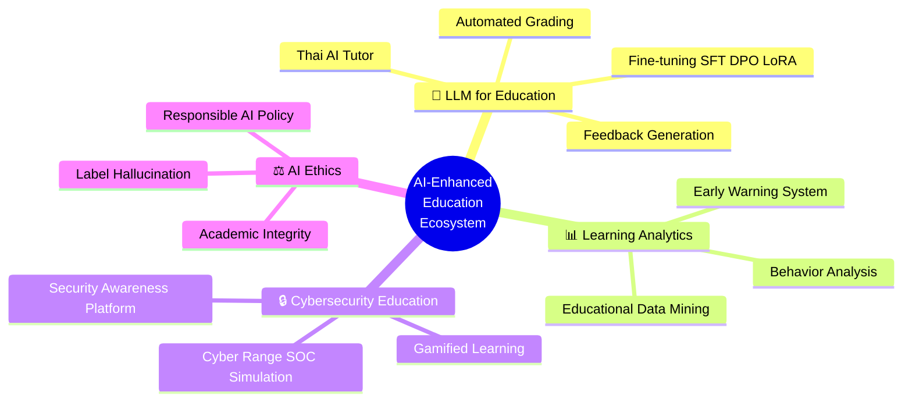

<div align="center">

# 🎓 Academic Portfolio

### Dr. Nutthakorn Chalaemwongwan

**Cybersecurity Advisor & Lecturer | Innovator | SOC & DFIR**

*Helping Build Resilient Cyber Defense*

---

_|_Ph.D._(MUT)_|_M.Sc._(KMUTT)_|_B.Eng._(MFLU)-0072B1?style=for-the-badge)


[](https://www.linkedin.com/in/nutthakorn/)

</div>

---

## 👤 About Me

| | |
|---|---|
| 🎓 **Education** | **D.B.A.** Industrial Business Administration — KMUTNB *(GPA 3.91)* |
| | **Ph.D.** Information Technology — Mahanakorn University of Technology |
| | **M.Sc.** Information Technology — KMUTT |
| | **B.Eng.** Information and Communication Engineering — MFLU |
| 🏫 **Academic** | Lecturer @ KOSEN-KMITL · KMUTNB · MFLU |
| 🔒 **Industry** | Founder — Monster Connect (11 yrs) · Advisor — Cyber Defense TH |
| | Project Manager — True Corporation · Pre-Sales Engineer — Simat Technologies |
| 🛡️ **Specializations** | Security Architecture · Cloud Security · DFIR · MDR/CSOC · Cryptography |

---

## 📚 Teaching Plans — IT & AI for Education (Graduate Level)

> ภาระงานสอนระดับปริญญาโทและปริญญาเอก  
> ภาควิชาครุศาสตร์เทคโนโลยีและสารสนเทศ คณะครุศาสตร์อุตสาหกรรม มจพ.

| รหัส | รายวิชา | English | Syllabus |
|:---:|---|---|:---:|
| 020525010 | การวิเคราะห์และออกแบบระบบ IT & AI เพื่อการศึกษา | Analysis and Design of IT & AI Systems for Education | [📄](teaching-plans/020525010_analysis_design.md) |
| 020527112 | จิตวิทยาเพื่อการออกแบบและพัฒนา IT & AI เพื่อการศึกษา | Psychology for Design and Development of IT & AI for Education | [📄](teaching-plans/020527112_psychology.md) |
| 020527113 | สัมมนา IT & AI เพื่อการศึกษา | Seminar in IT & AI for Education | [📄](teaching-plans/020527113_seminar.md) |
| 020527114 | ปัญหาพิเศษทาง IT & AI เพื่อการศึกษา | Special Problems in IT & AI for Education | [📄](teaching-plans/020527114_special_problems.md) |
| 020527115 | เรื่องคัดเฉพาะทาง IT & AI เพื่อการศึกษา | Selected Topics in IT & AI for Education | [📄](teaching-plans/020527115_selected_topics.md) |

---

## 🔬 Research Plan (2026–2029)

> 📊 [แผนงานวิจัย 3 ปี ฉบับเต็ม →](research-plan/research_plan_2026_2029.md)

### Publication Track Record

```
✅ Published          7 papers    ██████████████░░░░░░░  
🟢 Accepted           2 papers    ████░░░░░░░░░░░░░░░░░  
🟡 Under Review       6 papers    ████████████░░░░░░░░░  
🔵 In Progress       17 papers    ██████████████████████  
━━━━━━━━━━━━━━━━━━━━━━━━━━━━━━━━━━━━━━━━━━━━━━━━━━━━━━
📊 Total             32 papers
```

### Research Areas



### Selected Publications

| # | Title | Venue | Year | Status |
|:---:|---|---|:---:|:---:|
| 1 | ThaiScamBench: Benchmark Dataset for Thai Scam/Phishing Detection | ICSEC | 2025 | ✅ |
| 2 | A Competency Development Framework for Digital Workforce | WSEAS | 2025 | ✅ |
| 3 | HMARL-SOC: Multi-Agent RL for Autonomous SOC | IEEE Access | 2026 | 🟡 |
| 4 | Automated Security Alert Analysis Using LLMs for SOC | Wiley ETRI | 2026 | 🟡 |
| 5 | Context-Aware Security Telemetry Reduction | IEEE Access | 2026 | 🟡 |
| 6 | AI-Driven Log Reduction and Storage Optimization | IJECE | 2026 | 🟡 |
| 7 | SALAD: Unified Benchmark for SOC Alert Classification | HuggingFace | 2026 | 🔵 |

---

## 🏫 Teaching Experience

### KOSEN-KMITL *(Jun 2025 – Present)*
- Security and Cryptography
- Introduction to Computer Network & Security
- Lab Work 4: Basic Computer Engineering (GitHub, Docker, Cloud)
- Cloud Infrastructure and Security (AWS)
- Software Security 2

### Mae Fah Luang University *(Aug – Nov 2025)*
- Software Security

### KMUTNB — Business Computer *(2021 – 2025)*
- Information System Security
- Electronic Commerce
- Computer Software Usage Skills

---

## 🛡️ Specializations

<div align="center">

| 🔐 Security | ☁️ Technology | 📋 Business |
|:---:|:---:|:---:|
| Security Architecture | Cloud Security (AWS) | IT Governance, Risk & Compliance |
| Cryptography | Application Security | Risk Assessment |
| Network Security | App Performance Monitoring | Online Business |
| Digital Forensics & IR | Managed Detection & Response | Security Awareness Education |

</div>

---

## 📜 Certifications *(138 total)*

<div align="center">

| Vendor | Certification | Year |
|---|---|:---:|
| AWS | Academy Educator | 2025 |
| SentinelOne | Partner Cloud Professional | 2025 |
| SentinelOne | Sales Professional | 2025 |
| Okta | Customer Identity Cloud Specialized | 2025 |
| SOCRadar | Cybersecurity Awareness Challenge | 2025 |
| *...and 133 more* | | |

</div>

---

## 💼 Industry Experience

| Period | Role | Company |
|---|---|---|
| 2015 – Present | **Founder** | Monster Connect Co., Ltd. |
| 2023 – Present | **Advisor** | Cyber Defense TH |
| 2013 – 2014 | **Project Manager** | True Corporation |
| 2011 – 2013 | **Key Account Pre-Sales Engineer** | Simat Technologies PCL |
| 2007 – 2011 | **Technical Consultant** | Modernform Integration Services |

---

<div align="center">

### 📧 Contact

**Dr. Nutthakorn Chalaemwongwan**

[](https://www.linkedin.com/in/nutthakorn/)
[](https://github.com/nutthakorn7)

*คณะครุศาสตร์อุตสาหกรรม มหาวิทยาลัยเทคโนโลยีพระจอมเกล้าพระนครเหนือ*  
*Faculty of Technical Education, King Mongkut's University of Technology North Bangkok*

</div>
