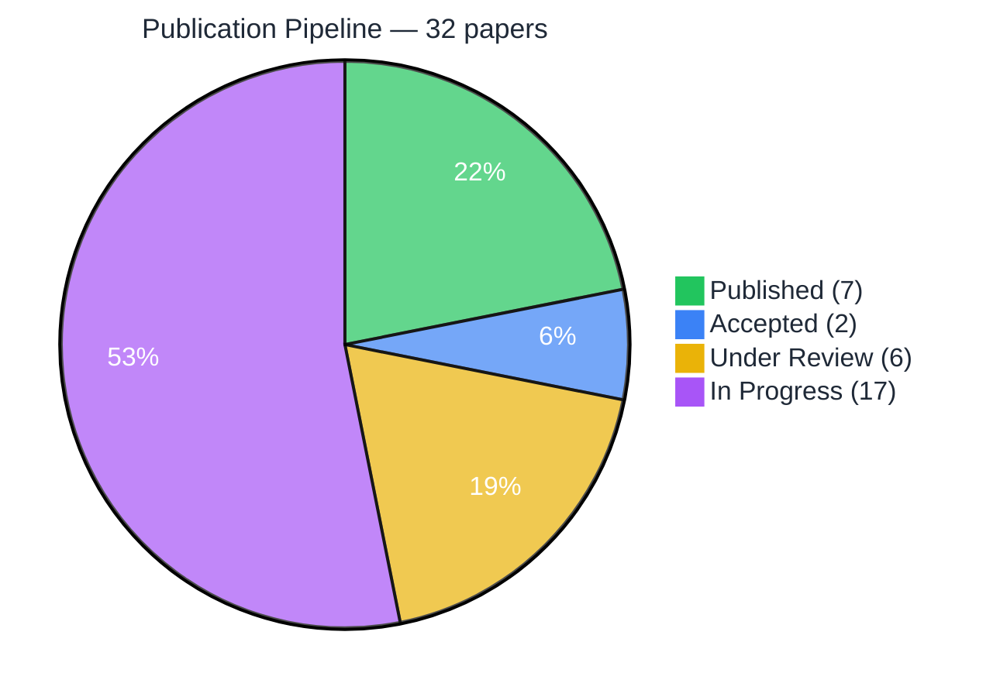
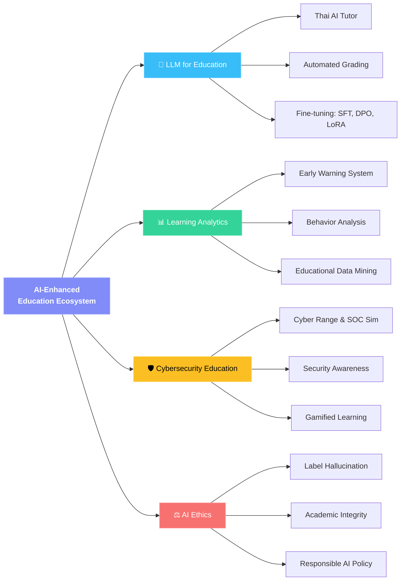

 

**Cybersecurity Advisor & Lecturer | Innovator | SOC & DFIR**

*Helping Build Resilient Cyber Defense*

 

_|_M.Sc._(KMUTT)_|_B.Eng._(MFLU)-0072B1?style=for-the-badge)

 

---

## 👤 About Me

<table>
<tr>
<td width="160"><b>🎓 Education</b></td>
<td>

| Degree | Field | University |
|:---:|:---|:---|
|  | Industrial Business Administration *(GPA 3.91)* | KMUTNB |
|  | Information Technology | KMUTT |
|  | Information & Communication Engineering | MFLU |

</td>
</tr>
<tr>
<td><b>🏫 Academic</b></td>
<td>Lecturer @ <b>KOSEN-KMITL</b> · <b>KMUTNB</b> · <b>MFLU</b></td>
</tr>
<tr>
<td><b>🔒 Industry</b></td>
<td>Founder — <b>Monster Connect</b> (11 yrs) · Advisor — <b>Cyber Defense TH</b> · PM — <b>True Corporation</b></td>
</tr>
<tr>
<td><b>🛡️ Specializations</b></td>
<td>

</td>
</tr>
</table>

---

## 📚 Teaching Plans — IT & AI for Education (Graduate Level)

> ภาระงานสอนระดับปริญญาโทและปริญญาเอก  
> ภาควิชาครุศาสตร์เทคโนโลยีและสารสนเทศ คณะครุศาสตร์อุตสาหกรรม มจพ.

| รหัส | รายวิชา | English | Syllabus |
|:---:|---|---|:---:|
| 020525010 | การวิเคราะห์และออกแบบระบบ IT & AI เพื่อการศึกษา | Analysis and Design of IT & AI Systems for Education | [📄](teaching-plans/020525010_analysis_design.md) |
| 020527112 | จิตวิทยาเพื่อการออกแบบและพัฒนา IT & AI เพื่อการศึกษา | Psychology for Design and Development of IT & AI for Education | [📄](teaching-plans/020527112_psychology.md) |
| 020527113 | สัมมนา IT & AI เพื่อการศึกษา | Seminar in IT & AI for Education | [📄](teaching-plans/020527113_seminar.md) |
| 020527114 | ปัญหาพิเศษทาง IT & AI เพื่อการศึกษา | Special Problems in IT & AI for Education | [📄](teaching-plans/020527114_special_problems.md) |
| 020527115 | เรื่องคัดเฉพาะทาง IT & AI เพื่อการศึกษา | Selected Topics in IT & AI for Education | [📄](teaching-plans/020527115_selected_topics.md) |

---

## 🔬 Research Plan (2026–2029)

> 📊 [แผนงานวิจัย 3 ปี ฉบับเต็ม →](research-plan/research_plan_2026_2029.md)

### Publication Track Record

### Research Areas

### Published & Accepted Papers

✅ <b>Published (7 papers)</b> — Click to expand

 

| # | Title | Venue | Year |
|:---:|---|---|:---:|
| 1 | ThaiScamBench: Toward a Benchmark Dataset for Scam and Phishing Detection in the Thai Language |  | 2025 |
| 2 | A Competency Development Framework for Digital Workforce in Industrial Business Organizations |  | 2025 |
| 3 | A Practical National Digital ID Framework on Blockchain (NiDBC) |  | 2018 |
| 4 | State of the Art and Challenges of Consensus Protocols on Blockchain |  | 2018 |
| 5 | Mobile Cloud Computing: A Survey and Propose Solution Framework |  | 2016 |
| 6 | Risk Management of Mobile Cloud Computing |  | 2015 |
| 7 | A Practical DRM Framework and Privacy on Cloud |  | 2014 |

🟢🟡 <b>Accepted (2) & Under Review (6)</b> — Click to expand

 

| # | Title | Venue | Year | Status |
|:---:|---|---|:---:|:---:|
| 1 | Workload-Aware Storage Reduction for Multi-Tenant SIEM on ClickHouse |  | 2026 | 🟢 Accepted |
| 2 | Comparative Evaluation of Log Reduction Techniques Using Vector |  | 2025 | 🟢 Accepted |
| 3 | ThaiScamBench and Beyond XLR: Bridging the Lab-to-Production Gap |  | 2026 | 🟡 Under Review |
| 4 | AI-Driven Log Reduction and Storage Optimization for Security Operations |  | 2026 | 🟡 Under Review |
| 5 | Context-Aware Security Telemetry Reduction: Streaming Architecture for SOC |  | 2026 | 🟡 Under Review |
| 6 | HMARL-SOC: Hierarchical Multi-Agent RL for Autonomous SOC Operations |  | 2026 | 🟡 Under Review |
| 7 | Automated Security Alert Analysis Using LLMs for SOC |  | 2026 | 🟡 Under Review |
| 8 | HMARL-SOC: Multi-Agent RL for Autonomous SOC Coordination |  | 2026 | 🟡 Under Review |

🔵 <b>In Progress (~17 papers)</b> — Click to expand

 

> Research series on **LLM Fine-tuning for SOC Alert Classification** — topics include Label Hallucination, DPO/ORPO, LoRA, Vocabulary Collapse, Cross-Domain Transfer, Quantization Effects, and more.

---

## 🏫 Teaching Experience

<table>
<tr>
<td width="50%" valign="top">

#### KOSEN-KMITL *(Jun 2025 – Present)*
- 🔐 Security and Cryptography
- 🌐 Introduction to Computer Network & Security
- 💻 Lab Work 4: Basic Computer Engineering
- ☁️ Cloud Infrastructure and Security (AWS)
- 🛡️ Software Security 2
- 📋 Project-Based Learning (PBL)

</td>
<td width="50%" valign="top">

#### Mae Fah Luang University *(Aug – Nov 2025)*
- 🛡️ Software Security

#### KMUTNB — Business Computer *(2021 – 2025)*
- 🔒 Information System Security
- 🛒 Electronic Commerce
- 💻 Computer Software Usage Skills

</td>
</tr>
</table>

---

## 🛡️ Specializations

| 🔐 Security | ☁️ Technology | 📋 Business |
|:---:|:---:|:---:|
| Security Architecture | Cloud Security (AWS) | IT Governance, Risk & Compliance |
| Cryptography | Application Security | Risk Assessment |
| Network Security | App Performance Monitoring | Online Business |
| Digital Forensics & IR | Managed Detection & Response | Security Awareness Education |

---

## 📜 Certifications *(138 total)*

🏅 <b>Recent Highlights</b> — Click to expand

 

| Vendor | Certification | Year |
|---|---|:---:|
|  AWS | Academy Educator | 2025 |
|  SentinelOne | Partner Cloud Professional | 2025 |
|  SentinelOne | Sales Professional | 2025 |
|  Okta | Customer Identity Cloud Specialized | 2025 |
|  SOCRadar | Cybersecurity Awareness Challenge | 2025 |
| *...and 133 more* | | |

---

## 💼 Industry Experience

| Period | Role | Company |
|---|---|---|
| 2015 – Present | **🚀 Founder** | Monster Connect Co., Ltd. |
| 2023 – Present | **🛡️ Advisor** | Cyber Defense TH |
| 2013 – 2014 | **📋 Project Manager** | True Corporation |
| 2011 – 2013 | **💼 Key Account Pre-Sales Engineer** | Simat Technologies PCL |
| 2007 – 2011 | **🔧 Technical Consultant** | Modernform Integration Services |

---

### 📧 Contact

**Dr. Nutthakorn Chalaemwongwan**

*คณะครุศาสตร์อุตสาหกรรม มหาวิทยาลัยเทคโนโลยีพระจอมเกล้าพระนครเหนือ*  
*Faculty of Technical Education, King Mongkut's University of Technology North Bangkok*

