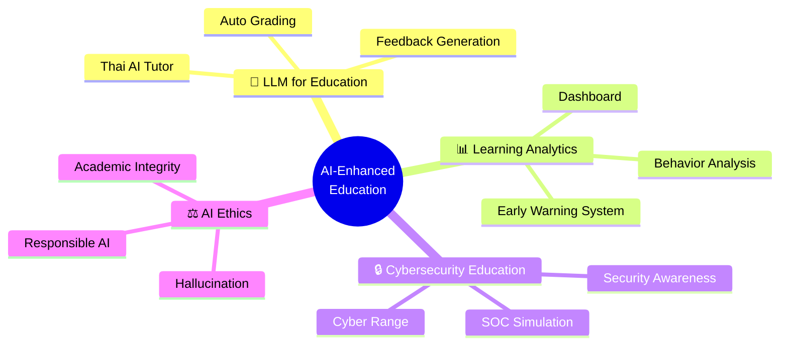

<div align="center">

# 🎓 Academic Portfolio

### ภาระงานสอนระดับบัณฑิตศึกษา
### คณะครุศาสตร์อุตสาหกรรม มหาวิทยาลัยเทคโนโลยีพระจอมเกล้าพระนครเหนือ
### Faculty of Technical Education, KMUTNB

---


</div>

---

## 👤 Profile

| | |
|---|---|
| 🎓 **Education** | **ปร.ด.** การบริหารธุรกิจอุตสาหกรรม — KMUTNB |
| | **วท.ม.** เทคโนโลยีสารสนเทศ — KMUTT |
| | **วศ.บ.** วิศวกรรมสารสนเทศและการสื่อสาร — MFLU |
| 🏫 **Teaching** | Lecturer @ KOSEN-KMITL · KMUTNB · MFLU |
| 🔒 **Industry** | Cybersecurity (MDR/CSOC) · Project Manager (True Corp.) |
| 🔬 **Specializations** | Security Architecture · Cloud Security · DFIR · Cryptography · AI/LLM |

---

## 📚 รายวิชาที่รับผิดชอบสอน (Teaching Responsibilities)

> หลักสูตรระดับปริญญาโทและปริญญาเอก สาขาเทคโนโลยีสารสนเทศและปัญญาประดิษฐ์เพื่อการศึกษา

| รหัส | รายวิชา | แผนการสอน |
|:---:|---|:---:|
| 020525010 | การวิเคราะห์และออกแบบระบบ IT & AI เพื่อการศึกษา | [📄 View](teaching-plans/020525010_analysis_design.md) |
| 020527112 | จิตวิทยาเพื่อการออกแบบและพัฒนา IT & AI เพื่อการศึกษา | [📄 View](teaching-plans/020527112_psychology.md) |
| 020527113 | สัมมนา IT & AI เพื่อการศึกษา | [📄 View](teaching-plans/020527113_seminar.md) |
| 020527114 | ปัญหาพิเศษทาง IT & AI เพื่อการศึกษา | [📄 View](teaching-plans/020527114_special_problems.md) |
| 020527115 | เรื่องคัดเฉพาะทาง IT & AI เพื่อการศึกษา | [📄 View](teaching-plans/020527115_selected_topics.md) |

---

## 🔬 Research Plan (2026–2029)

> 📊 [แผนงานวิจัย 3 ปี ฉบับเต็ม →](research-plan/research_plan_2026_2029.md)

### Track Record

```
✅ Published          7 papers
🟢 Accepted           2 papers
🟡 Under Review       6 papers
🔵 In Progress       17 papers
━━━━━━━━━━━━━━━━━━━━━━━━━━━━
📊 Total             32 papers
```

### Research Areas



### Key Publications

| # | Title | Venue | Status |
|:---:|---|---|:---:|
| 1 | ThaiScamBench: Benchmark Dataset for Thai Scam/Phishing Detection | ICSEC 2025 | ✅ Published |
| 2 | Workload-Aware Storage Reduction for Multi-Tenant SIEM on ClickHouse | IJACSA | 🟢 Accepted |
| 3 | HMARL-SOC: Hierarchical Multi-Agent RL for Autonomous SOC | IEEE Access | 🟡 Under Review |
| 4 | Automated Security Alert Analysis Using LLMs for SOC | Wiley ETRI | 🟡 Under Review |
| 5 | Context-Aware Security Telemetry Reduction: Streaming Architecture | IEEE Access | 🟡 Under Review |
| 6 | SALAD: SOC Alert Labeled Analysis Dataset | HuggingFace/Zenodo | 🔵 In Progress |

---

## 🏫 ประสบการณ์การสอน (Teaching Experience)

### KOSEN-KMITL
| วิชา | ภาษา |
|---|---|
| Security and Cryptography | EN |
| Introduction to Computer Network & Security | EN |
| Lab Work 4 for Basic Computer Engineering (GitHub, Docker, Cloud) | EN |
| Cloud Infrastructure and Security (AWS) | EN |
| Software Security 2 | EN |

### MFLU — Software Engineer
| วิชา | ภาษา |
|---|---|
| Software Security | TH |

### KMUTNB — Business Computer
| วิชา | ภาษา |
|---|---|
| Information System Security | TH |
| Electronic Commerce | TH |
| Computer Software Usage Skills | TH |

---

## 🛡️ Specializations

<div align="center">

| Security | Technology | Business |
|:---:|:---:|:---:|
| Security Architecture | Cloud Security (AWS) | IT Governance, Risk & Compliance |
| Cryptography | Application Security | Risk Assessment |
| Network Security | Application Performance Monitoring | Online Business |
| Digital Forensics & IR | Managed Detection & Response | Security Awareness Education |

</div>

---

<div align="center">

### 📧 Contact

*คณะครุศาสตร์อุตสาหกรรม มหาวิทยาลัยเทคโนโลยีพระจอมเกล้าพระนครเหนือ*

*Faculty of Technical Education, King Mongkut's University of Technology North Bangkok*

</div>
