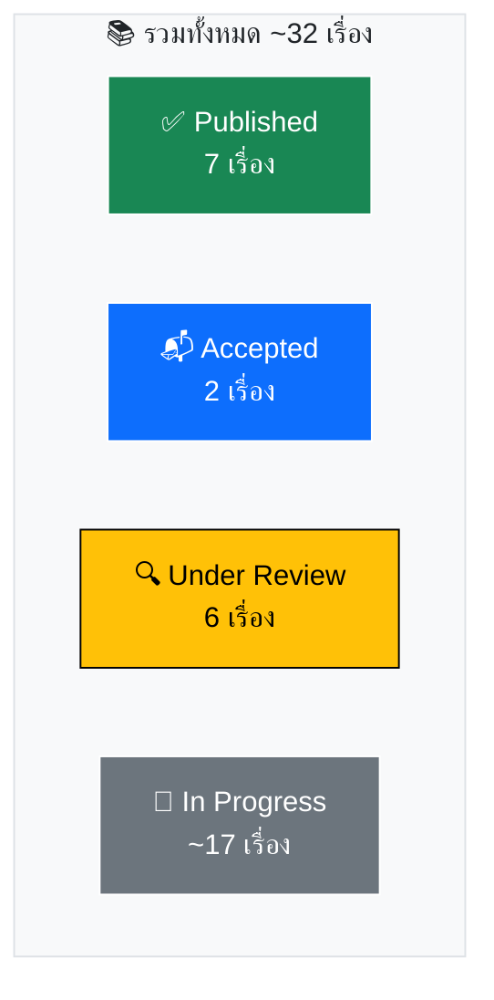
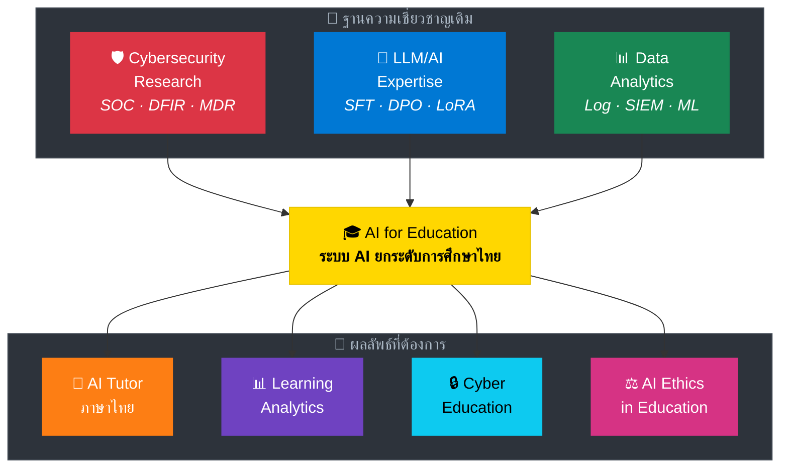
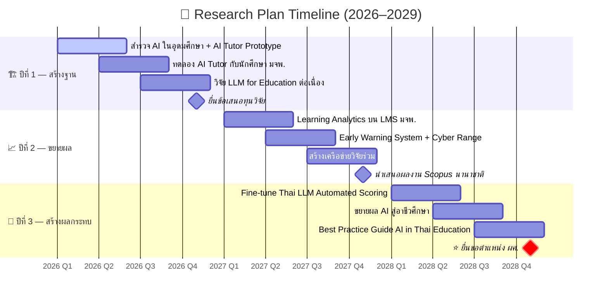
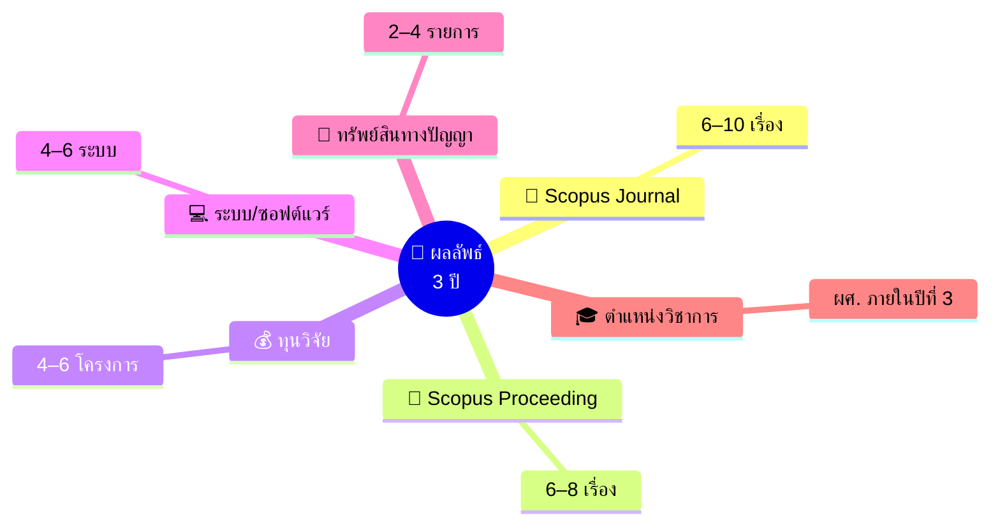
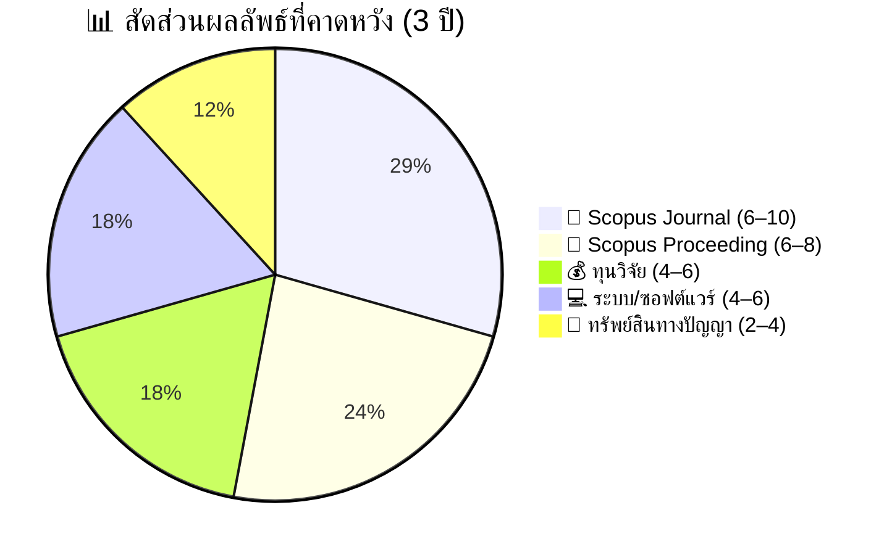

### 👨‍🔬 Dr. Nutthakorn Chalaemwongwan
**ภาควิชาครุศาสตร์เทคโนโลยีและสารสนเทศ · คณะครุศาสตร์อุตสาหกรรม**  
**มหาวิทยาลัยเทคโนโลยีพระจอมเกล้าพระนครเหนือ (มจพ.)**

 

-0072B1?style=for-the-badge)

 

 

##  สารบัญ (Table of Contents)

| | หัวข้อ | | หัวข้อ |
|:---:|:---|:---:|:---|
| [👤](#-ประวัติผู้วิจัย) | ประวัติผู้วิจัย | [📊](#-track-record-ผลงานวิจัยปัจจุบัน) | Track Record |
| [🔭](#-วิสัยทัศน์ด้านการวิจัย-research-vision) | วิสัยทัศน์การวิจัย | [🎯](#-สาขาวิจัยหลัก-research-areas) | สาขาวิจัยหลัก |
| [📅](#-แผนงานตามช่วงเวลา-timeline) | แผนงาน Timeline | [🎯](#-ผลลัพธ์ที่คาดหวังรวม-3-ปี) | ผลลัพธ์ที่คาดหวัง |
| [💰](#-แหล่งทุนวิจัยเป้าหมาย) | แหล่งทุนวิจัย | | |

---

## 👤 ประวัติผู้วิจัย

<table>
<tr>
<td width="50%" valign="top">

#### 🎓 วุฒิการศึกษา

| ระดับ | สาขา | สถาบัน |
|:---:|:---|:---|
|  | การบริหารธุรกิจอุตสาหกรรม | มจพ. *(GPA 3.91)* |
|  | เทคโนโลยีสารสนเทศ | ม.มหานคร |
|  | เทคโนโลยีสารสนเทศ | มจธ. |
|  | วิศวกรรมสารสนเทศฯ | มฟล. |

</td>
<td width="50%" valign="top">

#### 🏢 ประสบการณ์

| ด้าน | รายละเอียด |
|:---|:---|
| 🏫 **สอน** | KOSEN-KMITL · มจพ. · มฟล. — **9 รายวิชา** |
| 🚀 **Founder** | Monster Connect *(11 ปี)* |
| 🛡️ **Advisor** | Cyber Defense TH |
| 📱 **PM** | True Corporation |

#### 📜 ใบรับรองวิชาชีพ

> AWS · SentinelOne · Okta · SOCRadar ฯลฯ

</td>
</tr>
</table>

#### 🛡️ ความเชี่ยวชาญ

---

## 📊 Track Record: ผลงานวิจัยปัจจุบัน

### 🏆 ผลงานเด่น (Highlighted Works)

<table>
<tr>
<td width="50%" valign="top">

> #### 🔬 ThaiScamBench
>   
> Benchmark Dataset สำหรับ  
> **Thai Scam/Phishing Detection**

> #### 🤖 HMARL-SOC
>   
> Hierarchical Multi-Agent RL  
> สำหรับ **Autonomous SOC**

</td>
<td width="50%" valign="top">

> #### 📦 SALAD Dataset
>   
> Unified Benchmark สำหรับ  
> **SOC Alert Classification**

> #### 📚 LLM Fine-tuning Series
>   
> Label Compliance · Hallucination  
> **DPO / ORPO**

</td>
</tr>
</table>

📖 <b>แหล่งตีพิมพ์ทั้งหมด (Click to expand)</b>

 

---

## 🔭 วิสัยทัศน์ด้านการวิจัย (Research Vision)

> [!IMPORTANT]
> นำประสบการณ์วิจัยด้าน **AI/LLM สำหรับ Cybersecurity** มาประยุกต์กับบริบท **การศึกษา**  
> เพื่อสร้างระบบ AI ที่ยกระดับคุณภาพการเรียนการสอนในประเทศไทย  
> โดยใช้ฐานความเชี่ยวชาญด้าน **LLM Fine-tuning**, **Data Analytics** และ **Security** เป็นจุดแข็ง

---

## 🎯 สาขาวิจัยหลัก (Research Areas)

<table>
<tr>
<td width="50%" valign="top">

**AI-Enhanced Education**

| | รายละเอียด |
|:---:|:---|
| 🧪 | Fine-tuning LLMs สำหรับ **AI Tutor ภาษาไทย** |
| ✍️ | Automated Essay Scoring / Feedback Generation |
| 📝 | AI-Powered Quiz & Assessment Generation |

> [!TIP]
> 🔗 **เชื่อมจากงานเดิม:** ใช้ประสบการณ์ LLM Fine-tuning *(SFT, DPO, LoRA)*

</td>
<td width="50%" valign="top">

**Educational Data Mining**

| | รายละเอียด |
|:---:|:---|
| ⚠️ | ระบบ **Early Warning** สำหรับนักศึกษาเสี่ยง Drop Out |
| 📈 | Learning Behavior Analysis บน LMS |
| 📋 | Dashboard สำหรับผู้บริหารสถาบัน |

> [!TIP]
> 🔗 **เชื่อมจากงานเดิม:** ใช้ประสบการณ์ Log Analytics จาก *SOC/SIEM*

</td>
</tr>
<tr>
<td width="50%" valign="top">

**Hands-on Cyber Learning**

| | รายละเอียด |
|:---:|:---|
| 🎮 | Cyber Range / Simulated SOC สำหรับนักศึกษา |
| 🔐 | Security Awareness Training Platform ด้วย AI |
| 🏆 | Gamified Cybersecurity Learning |

> [!TIP]
> 🔗 **เชื่อมจากงานเดิม:** ใช้ประสบการณ์ *MDR/CSOC* ตรงๆ

</td>
<td width="50%" valign="top">

**จริยธรรม AI ในการศึกษา**

| | รายละเอียด |
|:---:|:---|
| 🔬 | ผลกระทบของ Generative AI ต่อ Academic Integrity |
| 🫧 | AI Hallucination ในบริบทการศึกษา |
| 📐 | แนวทางใช้ AI อย่างมีจริยธรรมในมหาวิทยาลัย |

> [!TIP]
> 🔗 **เชื่อมจากงานเดิม:** ใช้งานวิจัย *Label Hallucination* ใน LLM

</td>
</tr>
</table>

---

## 📅 แผนงานตามช่วงเวลา (Timeline)

 

### 🏗️ ปีที่ 1 (2569 / 2026) — สร้างฐาน &nbsp;&nbsp;  &nbsp; *(คลิกเพื่อดูรายละเอียด)*

 

> [!NOTE]
> 🎯 **เป้าหมาย:** วางรากฐานงานวิจัยด้าน AI for Education + สร้าง AI Tutor Prototype + ตีพิมพ์ Scopus 6 เรื่อง

| ไตรมาส | กิจกรรม | ผลลัพธ์ |
|:---:|:---|:---|
| 📌 **Q1–Q2** | สำรวจการใช้ AI ในอุดมศึกษาไทย + พัฒนา AI Tutor Prototype |  |
| 📌 **Q2–Q3** | ทดลอง AI Tutor กับนักศึกษา มจพ. |  |
| 📌 **Q3–Q4** | ดำเนินงานวิจัย LLM for Education ต่อเนื่อง |  |
| 📌 **Q4** | ยื่นข้อเสนอทุนวิจัย (วช. / สกสว. / ทุนภายใน มจพ.) |  |

### 📈 ปีที่ 2 (2570 / 2027) — ขยายผล &nbsp;&nbsp;  &nbsp; *(คลิกเพื่อดูรายละเอียด)*

 

> [!NOTE]
> 🎯 **เป้าหมาย:** ขยาย Learning Analytics + สร้าง Cyber Range + สร้างเครือข่ายวิจัยนานาชาติ

| ไตรมาส | กิจกรรม | ผลลัพธ์ |
|:---:|:---|:---|
| 📌 **Q1–Q2** | Learning Analytics: วิเคราะห์ข้อมูลผู้เรียนบน LMS มจพ. |  |
| 📌 **Q2–Q3** | พัฒนา Early Warning System + Cyber Range สำหรับนักศึกษา |  |
| 📌 **Q3–Q4** | สร้างเครือข่ายวิจัยร่วม (ม.ไทย + ต่างประเทศ) |  |
| 📌 **Q4** | นำเสนอผลงานในการประชุม Scopus นานาชาติ |  |

### 🚀 ปีที่ 3 (2571 / 2028) — สร้างผลกระทบ &nbsp;&nbsp;  &nbsp; *(คลิกเพื่อดูรายละเอียด)*

 

> [!CAUTION]
> 🎯 **เป้าหมาย:** สร้าง Thai LLM สำหรับ Education + ถ่ายทอดเทคโนโลยี + **ยื่นขอตำแหน่ง ผศ.**

| ไตรมาส | กิจกรรม | ผลลัพธ์ |
|:---:|:---|:---|
| 📌 **Q1–Q2** | Fine-tune Thai LLM สำหรับ Automated Scoring ภาษาไทย |  |
| 📌 **Q2–Q3** | ขยายผล AI สู่โรงเรียนอาชีวศึกษาในเครือข่าย |  |
| 📌 **Q3–Q4** | จัดทำ Best Practice Guide: AI in Thai Education |  |
| ⭐ **Q4** | **ยื่นขอตำแหน่ง ผู้ช่วยศาสตราจารย์** |  |

---

## 🎯 ผลลัพธ์ที่คาดหวังรวม 3 ปี

<table>
<tr>
<td width="33%" align="center">

</td>
<td width="33%" align="center">

</td>
<td width="33%" align="center">

</td>
</tr>
<tr>
<td align="center">

</td>
<td align="center">

</td>
<td align="center">

</td>
</tr>
</table>

---

## 💰 แหล่งทุนวิจัยเป้าหมาย

<table>
<tr>
<td align="center" width="20%">

### 🏛️
**วช.**  

</td>
<td align="center" width="20%">

### 🔬
**สกสว.**  

</td>
<td align="center" width="20%">

### 👨‍🎓
**บพค.**  

</td>
<td align="center" width="20%">

### 🏫
**ทุนภายใน มจพ.**  

</td>
<td align="center" width="20%">

### 🌍
**ทุนนานาชาติ**  

</td>
</tr>
</table>

---

**📧 Contact:** [Dr. Nutthakorn Chalaemwongwan](https://www.linkedin.com/in/nutthakorn/)

*คณะครุศาสตร์อุตสาหกรรม มหาวิทยาลัยเทคโนโลยีพระจอมเกล้าพระนครเหนือ*

