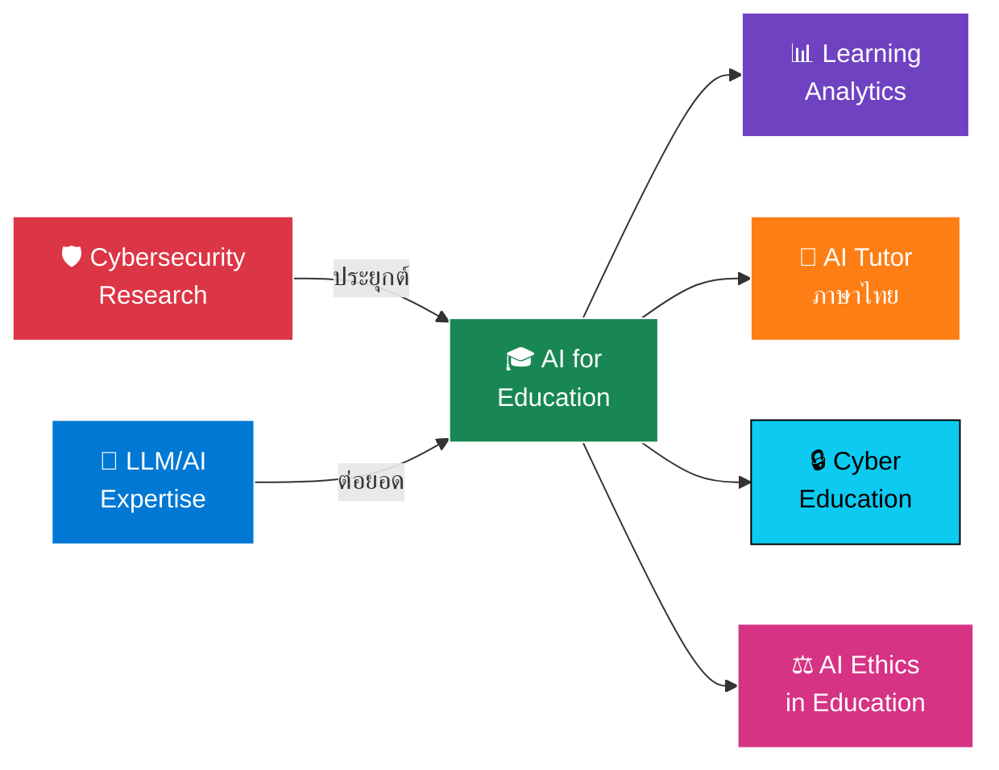
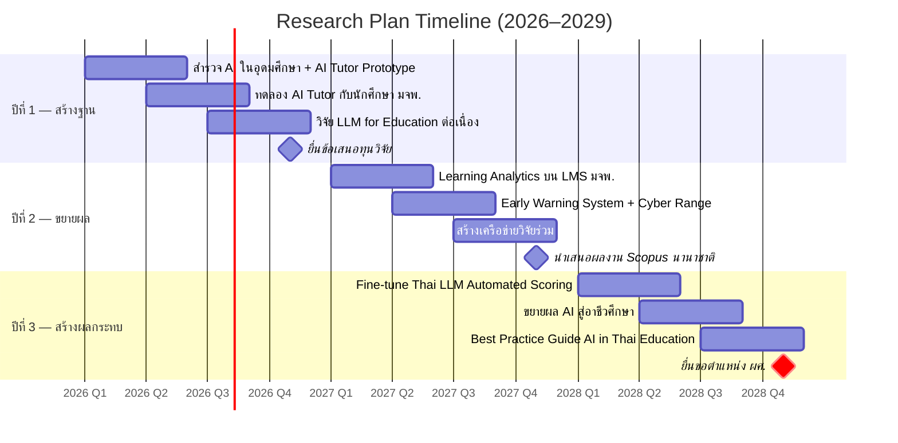
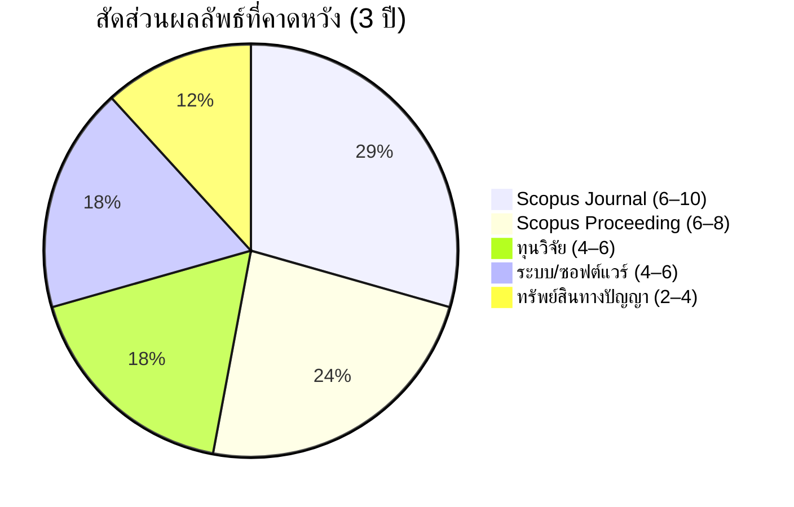

# 🔬 แผนงานวิจัย 3 ปี
## Research Plan 2026–2029

### Dr. Nutthakorn Chalaemwongwan
**ภาควิชาครุศาสตร์เทคโนโลยีและสารสนเทศ**  
**คณะครุศาสตร์อุตสาหกรรม มหาวิทยาลัยเทคโนโลยีพระจอมเกล้าพระนครเหนือ**

-0072B1?style=for-the-badge&logo=academia&logoColor=white)

---

## 👤 ประวัติผู้วิจัย

<table>
<tr>
<td width="180"><b>🎓 วุฒิการศึกษา</b></td>
<td>
  
-003366?style=flat-square)

</td>
</tr>
<tr>
<td><b>🏫 ประสบการณ์สอน</b></td>
<td>อาจารย์ KOSEN-KMITL · มจพ. · มฟล. — รวม <b>9 รายวิชา</b> ใน <b>3 สถาบัน</b></td>
</tr>
<tr>
<td><b>🏢 ประสบการณ์อุตสาหกรรม</b></td>
<td>Founder — Monster Connect <i>(11 ปี)</i> · Advisor — Cyber Defense TH · PM — True Corp.</td>
</tr>
<tr>
<td><b>🛡️ ความเชี่ยวชาญ</b></td>
<td>

</td>
</tr>
<tr>
<td><b>📜 ใบรับรองวิชาชีพ</b></td>
<td><b>138</b> Certifications — AWS, SentinelOne, Okta, SOCRadar ฯลฯ</td>
</tr>
</table>

---

## 📊 Track Record: ผลงานวิจัยปัจจุบัน

| สถานะ | | จำนวน |
|:---|:---|:---:|
| ✅ **Published** | ตีพิมพ์แล้ว | **7** เรื่อง |
| 📬 **Accepted** | ตอบรับแล้ว | **2** เรื่อง |
| 🔍 **Under Review** | อยู่ระหว่างพิจารณา | **6** เรื่อง |
| 🔧 **In Progress** | กำลังดำเนินการ | **~17** เรื่อง |
| 📚 **รวมทั้งหมด** | | **~32 เรื่อง** |

### 🏆 ผลงานเด่น

| ผลงาน | รายละเอียด | สถานะ |
|:---|:---|:---:|
| **ThaiScamBench** | Benchmark Dataset สำหรับ Thai Scam/Phishing Detection |  |
| **HMARL-SOC** | Hierarchical Multi-Agent RL สำหรับ Autonomous SOC |  |
| **SALAD Dataset** | Unified Benchmark สำหรับ SOC Alert Classification |  |
| **LLM Fine-tuning Series** | Label Compliance, Hallucination, DPO/ORPO |  |

> **แหล่งตีพิมพ์:** `IEEE Access` · `Wiley ETRI Journal` · `IJECE` · `IJACSA` · `ECTI` · `ICSEC` · `ITC-CSCC` · `ICOIN`

---

## 🔭 วิสัยทัศน์ด้านการวิจัย (Research Vision)

> 🌟 นำประสบการณ์วิจัยด้าน **AI/LLM สำหรับ Cybersecurity** มาประยุกต์กับบริบท **การศึกษา**  
> เพื่อสร้างระบบ AI ที่ยกระดับคุณภาพการเรียนการสอนในประเทศไทย  
> โดยใช้ฐานความเชี่ยวชาญด้าน **LLM Fine-tuning**, **Data Analytics** และ **Security** เป็นจุดแข็ง

---

## 🎯 สาขาวิจัยหลัก (Research Areas)

<table>
<tr>
<td width="50%" valign="top">

### 🤖 1. AI & LLM เพื่อการศึกษา
**AI-Enhanced Education**

- 🧪 Fine-tuning LLMs สำหรับ **AI Tutor ภาษาไทย**
- ✍️ Automated Essay Scoring / Feedback Generation
- 📝 AI-Powered Quiz & Assessment Generation
- 🔗 **เชื่อมจากงานเดิม:** ใช้ประสบการณ์ LLM Fine-tuning (SFT, DPO, LoRA)

</td>
<td width="50%" valign="top">

### 📊 2. Learning Analytics & EDM
**Educational Data Mining**

- ⚠️ ระบบ **Early Warning** สำหรับนักศึกษาเสี่ยง Drop Out
- 📈 Learning Behavior Analysis บน LMS
- 📋 Dashboard สำหรับผู้บริหารสถาบัน
- 🔗 **เชื่อมจากงานเดิม:** ใช้ประสบการณ์ Log Analytics จาก SOC/SIEM

</td>
</tr>
<tr>
<td width="50%" valign="top">

### 🛡️ 3. Cybersecurity Education & Training
**Hands-on Cyber Learning**

- 🎮 Cyber Range / Simulated SOC สำหรับนักศึกษา
- 🔐 Security Awareness Training Platform ด้วย AI
- 🏆 Gamified Cybersecurity Learning
- 🔗 **เชื่อมจากงานเดิม:** ใช้ประสบการณ์ MDR/CSOC ตรงๆ

</td>
<td width="50%" valign="top">

### ⚖️ 4. AI Ethics & Responsible AI
**จริยธรรม AI ในการศึกษา**

- 🔬 ผลกระทบของ Generative AI ต่อ Academic Integrity
- 🫧 AI Hallucination ในบริบทการศึกษา
- 📐 แนวทางใช้ AI อย่างมีจริยธรรมในมหาวิทยาลัย
- 🔗 **เชื่อมจากงานเดิม:** ใช้งานวิจัย Label Hallucination ใน LLM

</td>
</tr>
</table>

---

## 📅 แผนงานตามช่วงเวลา (Timeline)

### 🏗️ ปีที่ 1 (2569 / 2026) — สร้างฐาน

> 

| ไตรมาส | กิจกรรม | ผลลัพธ์ |
|:---:|:---|:---|
| 📌 **Q1–Q2** | สำรวจการใช้ AI ในอุดมศึกษาไทย + พัฒนา AI Tutor Prototype | 📄 บทความ Scopus **2** เรื่อง |
| 📌 **Q2–Q3** | ทดลอง AI Tutor กับนักศึกษา มจพ. | 📄 บทความ Scopus **2** เรื่อง |
| 📌 **Q3–Q4** | ดำเนินงานวิจัย LLM for Education ต่อเนื่อง | 📄 บทความ Scopus **2** เรื่อง |
| 📌 **Q4** | ยื่นข้อเสนอทุนวิจัย (วช. / สกสว. / ทุนภายใน มจพ.) | 📋 ข้อเสนอทุน **2** ฉบับ |

### 📈 ปีที่ 2 (2570 / 2027) — ขยายผล

> 

| ไตรมาส | กิจกรรม | ผลลัพธ์ |
|:---:|:---|:---|
| 📌 **Q1–Q2** | Learning Analytics: วิเคราะห์ข้อมูลผู้เรียนบน LMS มจพ. | 📄 บทความ Scopus **2–4** เรื่อง |
| 📌 **Q2–Q3** | พัฒนา Early Warning System + Cyber Range สำหรับนักศึกษา | 💻 ระบบต้นแบบ **2** ระบบ + IP |
| 📌 **Q3–Q4** | สร้างเครือข่ายวิจัยร่วม (ม.ไทย + ต่างประเทศ) | 🤝 MoU / Joint Research **2–4** แห่ง |
| 📌 **Q4** | นำเสนอผลงานในการประชุม Scopus นานาชาติ | 📄 Scopus Proceeding **2–4** เรื่อง |

### 🚀 ปีที่ 3 (2571 / 2028) — สร้างผลกระทบ

> 

| ไตรมาส | กิจกรรม | ผลลัพธ์ |
|:---:|:---|:---|
| 📌 **Q1–Q2** | Fine-tune Thai LLM สำหรับ Automated Scoring ภาษาไทย | 🤖 โมเดล + 📄 Scopus **2** เรื่อง |
| 📌 **Q2–Q3** | ขยายผล AI สู่โรงเรียนอาชีวศึกษาในเครือข่าย | 🏫 ถ่ายทอดเทคโนโลยี **6–10** แห่ง |
| 📌 **Q3–Q4** | จัดทำ Best Practice Guide: AI in Thai Education | 📖 คู่มือ + 📄 Scopus **2** เรื่อง |
| 📌 **Q4** | ⭐ ยื่นขอตำแหน่ง **ผู้ช่วยศาสตราจารย์** | 📋 เอกสารยื่นขอตำแหน่ง |

---

## 🎯 ผลลัพธ์ที่คาดหวังรวม 3 ปี

| ผลลัพธ์ | เป้าหมาย | |
|:---|:---:|:---|
| 📄 **บทความ Scopus (Journal)** | **6–10** เรื่อง |  |
| 📑 **บทความ Scopus (Proceeding)** | **6–8** เรื่อง |  |
| 💰 **ทุนวิจัย** | **4–6** โครงการ |  |
| 💻 **ระบบ/ซอฟต์แวร์** | **4–6** ระบบ |  |
| 📜 **ทรัพย์สินทางปัญญา** | **2–4** รายการ |  |
| 🎓 **ตำแหน่งวิชาการ** | **ผศ.** ภายในปีที่ 3 |  |

---

## 💰 แหล่งทุนวิจัยเป้าหมาย

<table>
<tr>
<td align="center" width="20%">

**🏛️ วช.**  
ทุนวิจัยพื้นฐาน  
และประยุกต์

</td>
<td align="center" width="20%">

**🔬 สกสว.**  
Fundamental  
Fund

</td>
<td align="center" width="20%">

**👨‍🎓 บพค.**  
ทุนพัฒนา  
กำลังคน

</td>
<td align="center" width="20%">

**🏫 ทุนภายใน มจพ.**  
ทุนวิจัยสำหรับ  
อาจารย์ใหม่

</td>
<td align="center" width="20%">

**🌍 ทุนนานาชาติ**  
Google Research  
ASEAN · UNESCO

</td>
</tr>
</table>

---

**📧 Contact:** [Dr. Nutthakorn Chalaemwongwan](https://www.linkedin.com/in/nutthakorn/)

*คณะครุศาสตร์อุตสาหกรรม มหาวิทยาลัยเทคโนโลยีพระจอมเกล้าพระนครเหนือ*

