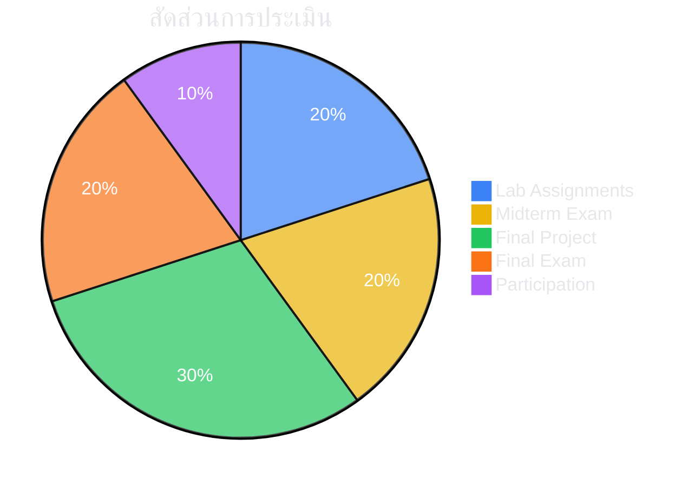

# 📐 020525010
## การวิเคราะห์และออกแบบระบบเทคโนโลยีสารสนเทศและปัญญาประดิษฐ์เพื่อการศึกษา
### Analysis and Design of IT & AI Systems for Education

-blue?style=for-the-badge)

---

## 📋 Course Description

> ศึกษาหลักการ แนวคิด และกระบวนการวิเคราะห์และออกแบบระบบเทคโนโลยีสารสนเทศและปัญญาประดิษฐ์เพื่อการศึกษา ครอบคลุมการวิเคราะห์ความต้องการ การออกแบบสถาปัตยกรรมระบบ การเลือกใช้เทคโนโลยี AI ที่เหมาะสม การพัฒนาระบบต้นแบบ และการประเมินประสิทธิภาพ

> [!NOTE]
> Study of principles, concepts, and processes in analysis and design of IT & AI systems for education — covering requirements analysis, system architecture, AI technology selection, prototyping, and evaluation.

---

## 🎯 Learning Objectives

| # | Objective | Bloom's Level |
|:---:|---|:---:|
| 1 | **อธิบาย** หลักการวิเคราะห์และออกแบบระบบสารสนเทศเพื่อการศึกษา | 💡 Understand |
| 2 | **วิเคราะห์** ความต้องการของผู้ใช้เพื่อกำหนดข้อกำหนดของระบบ | 🔍 Analyze |
| 3 | **ออกแบบ** สถาปัตยกรรมระบบที่ผสมผสาน AI กับการศึกษา | 🏗️ Create |
| 4 | **เลือกใช้** เทคโนโลยี AI ที่เหมาะสม (ML, NLP, GenAI) | ⚡ Apply |
| 5 | **พัฒนา** ระบบต้นแบบ AI เพื่อการศึกษา | 🛠️ Create |
| 6 | **ประเมิน** ประสิทธิภาพและความเหมาะสมของระบบ | 📊 Evaluate |

---

## 📅 Weekly Schedule

| 🗓️ | หัวข้อ | 📝 กิจกรรม |
|:---:|---|---|
| **1** | 🌟 แนะนำรายวิชา — ภาพรวม IT & AI ในการศึกษายุคดิจิทัล | บรรยาย + อภิปรายแนวโน้ม |
| **2** | 📊 หลักการวิเคราะห์ระบบ (Systems Analysis Fundamentals) | บรรยาย + กรณีศึกษา LMS |
| **3** | 👥 การวิเคราะห์ความต้องการผู้ใช้ (User Requirements) | Workshop: สัมภาษณ์ + User Persona |
| **4** | 🎨 การออกแบบ UX/UI สำหรับระบบการศึกษา | Workshop: Wireframing + Figma |
| **5** | 🏗️ สถาปัตยกรรมระบบสารสนเทศเพื่อการศึกษา | บรรยาย + Lab: System Architecture |
| **6** | 🤖 AI พื้นฐานเพื่อการศึกษา (ML, DL, NLP) | บรรยาย + Demo: AI APIs |
| **7** | 🧠 Intelligent Tutoring Systems & Adaptive Learning | กรณีศึกษา + วิเคราะห์ ITS |
| **8** | 📝 **สอบกลางภาค (Midterm Examination)** | ข้อเขียน + กรณีศึกษา |
| **9** | 🚀 Generative AI & LLMs ในการศึกษา | Lab: Prompt Engineering + Fine-tuning |
| **10** | 📈 Learning Analytics & Educational Data Mining | Lab: วิเคราะห์ข้อมูลด้วย Python |
| **11** | 💬 การออกแบบ Chatbot & AI Assistant เพื่อการเรียนรู้ | Workshop: สร้าง Educational Chatbot |
| **12** | ✅ การประเมินและทดสอบระบบ (System Evaluation) | Lab: Usability Testing |
| **13** | ⚖️ จริยธรรม AI ในการศึกษา (AI Ethics) | อภิปราย + กรณีศึกษา |
| **14** | 🎤 นำเสนอโครงงาน รอบที่ 1 | นำเสนอ + Feedback |
| **15** | 🎤 นำเสนอโครงงาน รอบสุดท้าย | นำเสนอผลงานสมบูรณ์ |
| **16** | 📝 **สอบปลายภาค (Final Examination)** | ข้อเขียน + โครงงาน |

---

## 📊 Assessment

| รายการ | สัดส่วน |
|---|:---:|
| 💬 การมีส่วนร่วมในชั้นเรียน | 10% |
| 💻 แบบฝึกปฏิบัติ (Lab Assignments) | 20% |
| 📝 สอบกลางภาค | 20% |
| 🚀 โครงงานกลุ่ม: ระบบ AI เพื่อการศึกษา | 30% |
| 📝 สอบปลายภาค | 20% |

---

## 🔧 Teaching Methods

> [!TIP]
> **แนวทาง "Build to Learn"** — เน้นให้นักศึกษาลงมือสร้างระบบจริง ไม่ใช่แค่ทฤษฎี

| วิธีการ | สัดส่วน | รายละเอียด |
|---|:---:|---|
| 🎓 บรรยายเชิงโต้ตอบ | 30% | Interactive Lecture + Q&A |
| 🛠️ ปฏิบัติการ/Workshop | 35% | Hands-on Lab + Coding |
| 📖 กรณีศึกษา | 15% | Case Study & Discussion |
| 🚀 โครงงาน | 20% | Project-Based Learning |

---

## 📚 Resources

### Textbooks
- 📘 Luckin, R. (2018). *Machine Learning and Human Intelligence*. UCL IOE Press.
- 📗 Holmes, W. et al. (2023). *Artificial Intelligence in Education*. CCR.

### Tools & Platforms
- 🐍 Python (Jupyter / Google Colab)
- 🤗 Hugging Face Transformers
- 🔑 OpenAI / Google Gemini APIs
- 🎨 Figma (UX/UI Design)

---

*คณะครุศาสตร์อุตสาหกรรม มหาวิทยาลัยเทคโนโลยีพระจอมเกล้าพระนครเหนือ*

