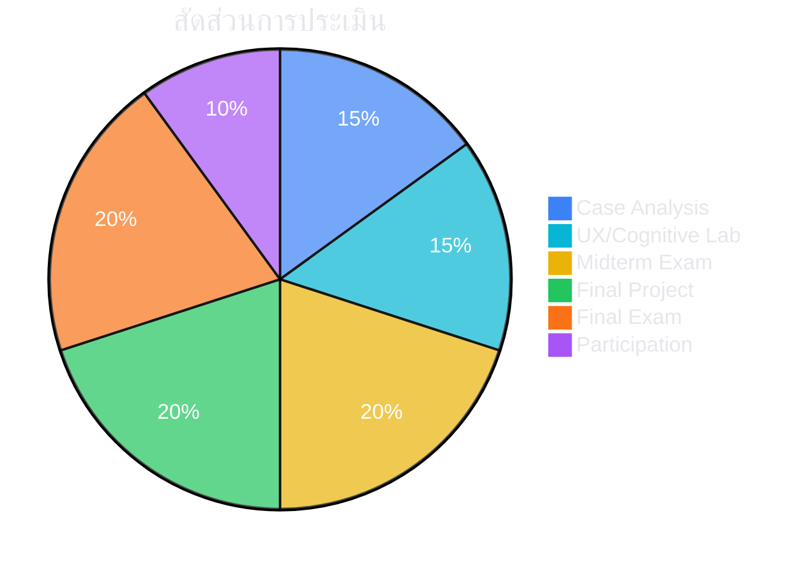

# 🧠 020527112
## จิตวิทยาเพื่อการออกแบบและพัฒนาเทคโนโลยีสารสนเทศและปัญญาประดิษฐ์เพื่อการศึกษา
### Psychology for Design and Development of IT & AI for Education

-blue?style=for-the-badge)

---

## 📋 Course Description

> ศึกษาทฤษฎีและหลักการทางจิตวิทยาที่เกี่ยวข้องกับการออกแบบและพัฒนาเทคโนโลยีสารสนเทศและปัญญาประดิษฐ์เพื่อการศึกษา ครอบคลุมจิตวิทยาการเรียนรู้ จิตวิทยาการรับรู้ UX Psychology แรงจูงใจ และการประยุกต์ใช้ AI ที่เข้าใจผู้เรียน

> [!NOTE]
> Study of psychological theories and principles for designing learner-centered EdTech and AI systems — covering learning psychology, cognitive load, UX design, motivation, and affective computing.

---

## 🎯 Learning Objectives

| # | Objective | Bloom's Level |
|:---:|---|:---:|
| 1 | **อธิบาย** ทฤษฎีการเรียนรู้หลักและเชื่อมโยงกับ EdTech | 💡 Understand |
| 2 | **วิเคราะห์** ปัจจัยจิตวิทยาที่ส่งผลต่อการเรียนผ่านเทคโนโลยี | 🔍 Analyze |
| 3 | **ประยุกต์** Cognitive Load Theory ในการออกแบบสื่อ | ⚡ Apply |
| 4 | **ออกแบบ** ระบบ EdTech ที่คำนึงถึงแรงจูงใจผู้เรียน | 🏗️ Create |
| 5 | **ประเมิน** ผลกระทบทางจิตวิทยาของ AI ต่อผู้เรียน | 📊 Evaluate |
| 6 | **สังเคราะห์** แนวทาง Personalized AI อย่างมีจริยธรรม | 🧩 Synthesize |

---

## 📅 Weekly Schedule

| 🗓️ | หัวข้อ | 📝 กิจกรรม |
|:---:|---|---|
| **1** | 🌟 จิตวิทยาพบเทคโนโลยี — ทำไมต้องเข้าใจผู้เรียนก่อนสร้างระบบ | บรรยาย + อภิปราย |
| **2** | 📖 ทฤษฎีการเรียนรู้ (1): Behaviorism & Cognitivism | บรรยาย + วิเคราะห์ EdTech |
| **3** | 🏗️ ทฤษฎีการเรียนรู้ (2): Constructivism & Connectivism | Workshop: ออกแบบกิจกรรม |
| **4** | 🧠 จิตวิทยาการรับรู้: ความจำ ความสนใจ การประมวลผล | บรรยาย + Cognitive Experiments |
| **5** | ⚡ Cognitive Load Theory และการออกแบบ Multimedia | Workshop: วิเคราะห์ Cognitive Load |
| **6** | 🎨 UX Psychology: ออกแบบอินเทอร์เฟซที่เป็นมิตร | Lab: Heuristic Evaluation |
| **7** | 🎮 แรงจูงใจ: Self-Determination Theory & Flow | กรณีศึกษา: Duolingo, Khan Academy |
| **8** | 📝 **สอบกลางภาค (Midterm Examination)** | ข้อเขียน + กรณีศึกษา |
| **9** | 🕹️ Gamification & Game-Based Learning | Workshop: ออกแบบ Gamification |
| **10** | 🌈 ความแตกต่างระหว่างบุคคล: Learning Styles & Neurodiversity | อภิปราย + Inclusive Design |
| **11** | 🤖 Human-AI Interaction ในบริบทการศึกษา | Lab: ทดลอง AI Tutor |
| **12** | 💚 Affective Computing: AI ที่เข้าใจอารมณ์ผู้เรียน | บรรยาย + Demo |
| **13** | ☀️ จิตวิทยาเชิงบวก & Digital Well-being | อภิปราย: Screen Time |
| **14** | ⚖️ จริยธรรมทางจิตวิทยาของ AI ในการศึกษา | อภิปราย: Privacy & Autonomy |
| **15** | 🎤 นำเสนอโครงงาน | นำเสนอ + Peer Review |
| **16** | 📝 **สอบปลายภาค (Final Examination)** | ข้อเขียน + โครงงาน |

---

## 📊 Assessment

| รายการ | สัดส่วน |
|---|:---:|
| 💬 การมีส่วนร่วมและอภิปราย | 10% |
| 📖 รายงานวิเคราะห์กรณีศึกษา | 15% |
| 🎨 แบบฝึก UX/UI & Cognitive Load | 15% |
| 📝 สอบกลางภาค | 20% |
| 🚀 โครงงาน: ออกแบบ EdTech ด้วยหลักจิตวิทยา | 20% |
| 📝 สอบปลายภาค | 20% |

---

## 📚 Resources

### Textbooks
- 📘 Clark, R. & Mayer, R. (2023). *e-Learning and the Science of Instruction* (5th ed.)
- 📗 Mayer, R. (2021). *Multimedia Learning* (3rd ed.)
- 📕 Schunk, D. (2020). *Learning Theories* (8th ed.)

### Recommended Reading
- 📙 Norman, D. (2013). *The Design of Everyday Things*
- 📓 Csikszentmihalyi, M. (2008). *Flow: The Psychology of Optimal Experience*

---

*คณะครุศาสตร์อุตสาหกรรม มหาวิทยาลัยเทคโนโลยีพระจอมเกล้าพระนครเหนือ*

