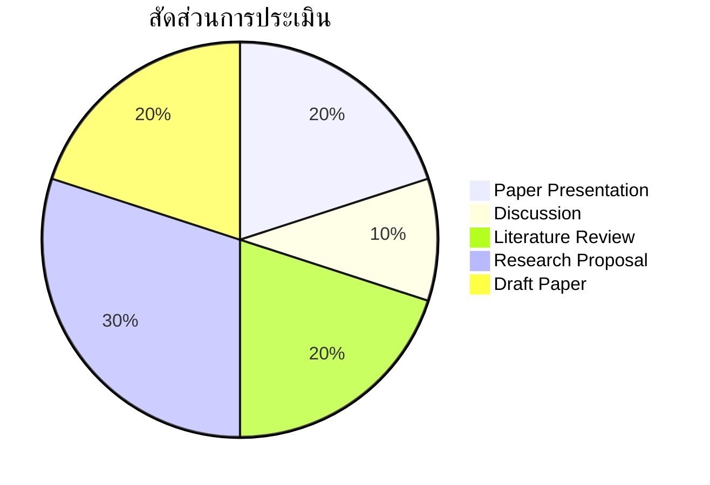

# 🎤 020527113
## สัมมนาเทคโนโลยีสารสนเทศและปัญญาประดิษฐ์เพื่อการศึกษา
### Seminar in IT & AI for Education

-blue?style=for-the-badge)

---

## 📋 Course Description

> ศึกษา ค้นคว้า วิเคราะห์ และอภิปรายงานวิจัยและแนวโน้มทาง IT & AI เพื่อการศึกษาระดับนานาชาติ ฝึกทักษะการนำเสนอ วิพากษ์งานวิจัย เขียนบทความวิชาการ และกำหนดประเด็นวิจัยใหม่

> [!NOTE]
> Academic seminar focusing on critical analysis of current research trends, paper presentation skills, academic writing, and research gap identification in AI for Education.

---

## 🎯 Learning Objectives

| # | Objective | Bloom's Level |
|:---:|---|:---:|
| 1 | **สืบค้น** งานวิจัยจาก Scopus, WoS, IEEE, ACM | 🔍 Analyze |
| 2 | **วิเคราะห์** และ **วิพากษ์** งานวิจัยอย่างเป็นระบบ | 🔍 Analyze |
| 3 | **นำเสนอ** งานวิจัยอย่างมีประสิทธิภาพ (ไทย + อังกฤษ) | 🎤 Apply |
| 4 | **ระบุ** Research Gap และตั้งคำถามวิจัยใหม่ | 🏗️ Create |
| 5 | **เขียน** บทความวิชาการมาตรฐาน IMRaD | ✍️ Create |

---

## 📅 Weekly Schedule

| 🗓️ | หัวข้อ | 📝 กิจกรรม |
|:---:|---|---|
| **1** | 🌟 ทักษะสัมมนาวิชาการในยุค AI | บรรยาย + กำหนดกติกา |
| **2** | 🔍 วิธีสืบค้น: Scopus, WoS, Google Scholar | Workshop: Zotero/Mendeley |
| **3** | 📖 วิธีอ่านและวิพากษ์ Paper (3-Pass Reading) | Workshop: ฝึกอ่าน Paper |
| **4** | 🤖 **Trend 1:** Generative AI in Education | 🎤 Paper Presentation |
| **5** | 📊 **Trend 2:** Learning Analytics & EDM | 🎤 Paper Presentation |
| **6** | 🧠 **Trend 3:** Intelligent Tutoring & Adaptive Learning | 🎤 Paper Presentation |
| **7** | 💬 **Trend 4:** NLP for Education — Auto Grading | 🎤 Paper Presentation |
| **8** | 📝 **Midterm: Literature Review Report** | นำเสนอรายงาน Literature Review |
| **9** | 🌐 **Trend 5:** Metaverse, VR/AR/XR in Education | 🎤 Paper Presentation |
| **10** | ⚖️ **Trend 6:** AI Ethics & Academic Integrity | 🎤 Paper Presentation |
| **11** | 👁️ **Trend 7:** Multimodal AI & Computer Vision | 🎤 Paper Presentation |
| **12** | ✍️ การเขียนบทความ: IMRaD + Abstract | Workshop: เขียน Abstract |
| **13** | 🔬 การหา Research Gap + ตั้งคำถามวิจัย | Workshop: Research Proposal |
| **14** | 🎙️ วิทยากรรับเชิญ: AI in Education Expert | บรรยายพิเศษ + Q&A |
| **15** | 🎤 **Final: Research Proposal Presentation** | นำเสนอ + Peer Review |
| **16** | 🌟 สรุป: ทิศทาง AI in Education 2026+ | อภิปราย + ส่งบทความ |

---

## 📊 Assessment

| รายการ | สัดส่วน |
|---|:---:|
| 🎤 นำเสนองานวิจัยรายสัปดาห์ | 20% |
| 💬 การมีส่วนร่วมในอภิปราย | 10% |
| 📖 Literature Review (Midterm) | 20% |
| 🔬 Research Proposal (Final) | 30% |
| ✍️ บทความวิชาการฉบับร่าง | 20% |

---

## 📚 Resources

### Databases
- 🔍 Scopus / Web of Science / IEEE Xplore / ACM
- 🎓 Google Scholar / Semantic Scholar / arXiv
- 🇹🇭 Thai Journal Online (ThaiJO) / TCI

### Top Journals to Follow
- 📘 *Computers & Education* (Elsevier)
- 📗 *British Journal of Educational Technology* (BJET)
- 📙 *Int. Journal of AI in Education* (IJAIED)

### Tools
- 📑 Zotero / Mendeley
- 🕸️ Connected Papers
- 🤖 Elicit / Semantic Scholar AI

---

*คณะครุศาสตร์อุตสาหกรรม มหาวิทยาลัยเทคโนโลยีพระจอมเกล้าพระนครเหนือ*

