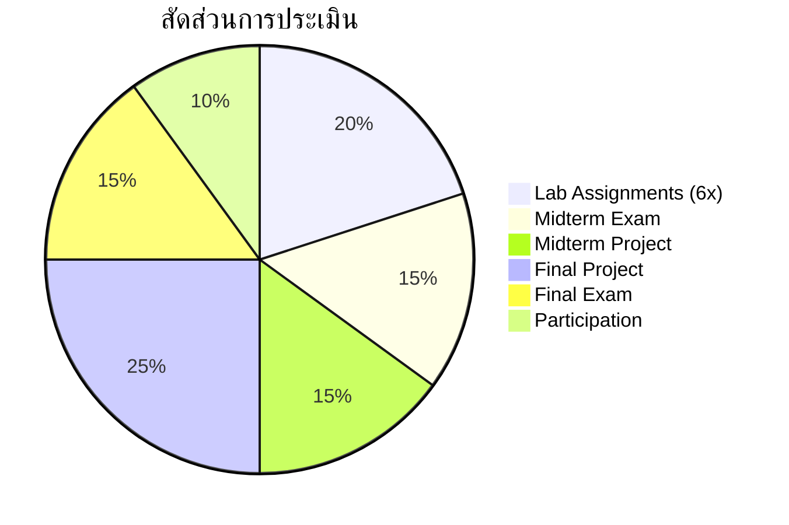

# 🚀 020527115
## เรื่องคัดเฉพาะทางด้านเทคโนโลยีสารสนเทศและปัญญาประดิษฐ์เพื่อการศึกษา
### Selected Topics in IT & AI for Education

-blue?style=for-the-badge)

> [!IMPORTANT]
> 🤖 **หัวข้อประจำภาค:** Generative AI & Large Language Models for Education
>
> *เนื้อหาเปลี่ยนแปลงได้ตามแนวโน้มเทคโนโลยีในแต่ละภาคการศึกษา*

---

## 📋 Course Description

> ศึกษาเรื่องคัดเฉพาะทางที่ทันสมัยด้าน IT & AI เพื่อการศึกษา สำหรับภาคเรียนนี้เน้น **Generative AI และ LLMs** ครอบคลุมหลักการทำงาน การประยุกต์ใช้ Fine-tuning และจริยธรรมในบริบทการศึกษา

> [!NOTE]
> This semester focuses on **Generative AI & LLMs for Education** — covering Transformer architecture, prompt engineering, fine-tuning (SFT/DPO/LoRA), and AI ethics.

---

## 🎯 Learning Objectives

| # | Objective | Bloom's Level |
|:---:|---|:---:|
| 1 | **อธิบาย** หลักการ Generative AI และ LLMs | 💡 Understand |
| 2 | **ใช้งาน** LLMs ผ่าน API + Prompt Engineering | ⚡ Apply |
| 3 | **Fine-tune** โมเดลภาษาสำหรับงานการศึกษา | 🛠️ Apply |
| 4 | **ออกแบบ** แอป AI เพื่อการเรียนการสอน | 🏗️ Create |
| 5 | **ประเมิน** คุณภาพและข้อจำกัดของ GenAI | 📊 Evaluate |
| 6 | **วิเคราะห์** จริยธรรม AI และ Academic Integrity | ⚖️ Analyze |

---

## 📅 Weekly Schedule

| 🗓️ | หัวข้อ | 📝 กิจกรรม |
|:---:|---|---|
| **1** | 🌟 Generative AI Overview: GPT → Multimodal AI | Demo: ChatGPT, Claude, Gemini |
| **2** | ⚙️ LLM Internals: Transformers, Attention, Tokenization | Lab: สำรวจ Hugging Face |
| **3** | ✨ Prompt Engineering สำหรับครูและอาจารย์ | Workshop: สร้างข้อสอบ/สรุปเนื้อหา |
| **4** | 🔗 Advanced Prompting: CoT, Few-shot, RAG | Lab: สร้าง RAG System |
| **5** | 💻 LLM APIs & App Development | Lab: สร้างแอป EdTech + API |
| **6** | 🔧 Fine-tuning 101: Supervised Fine-Tuning (SFT) | Lab: Fine-tune บน Colab |
| **7** | 🚀 Advanced Fine-tuning: LoRA, QLoRA, DPO | Lab: Fine-tune Thai Education |
| **8** | 📝 **Midterm Exam + Project Demo** | สอบ + Demo |
| **9** | 🎨 AI Content Creation: ภาพ, วิดีโอ, เสียง | Lab: DALL-E, Runway, ElevenLabs |
| **10** | ✅ AI for Assessment: ตรวจข้อสอบ + Feedback | Lab: Auto-Grading ด้วย LLM |
| **11** | 💬 AI Tutor & Chatbot Development | Lab: LangChain Chatbot |
| **12** | 📊 Model Evaluation: BLEU, ROUGE, Human Eval | Lab: วัดคุณภาพ LLM |
| **13** | ⚖️ AI Ethics: Bias, Hallucination, Integrity | อภิปราย + กรณีศึกษา |
| **14** | 📜 นโยบาย AI ในสถาบันการศึกษา | อภิปราย + ออกแบบ AI Policy |
| **15** | 🎤 **Final Project Presentation** | นำเสนอ + Demo |
| **16** | 📝 **สอบปลายภาค (Final Exam)** | สอบข้อเขียน |

---

## 📊 Assessment

| รายการ | สัดส่วน |
|---|:---:|
| 💻 Lab Assignments (6 ครั้ง) | 20% |
| 💬 การมีส่วนร่วม | 10% |
| 📝 สอบกลางภาค | 15% |
| 🔧 Midterm Project: Prompt Engineering App | 15% |
| 🚀 Final Project: AI-Powered EdTech App | 25% |
| 📝 สอบปลายภาค | 15% |

---

## 💡 Project Ideas

| ประเภท | ตัวอย่าง |
|---|---|
| 🤖 **AI Tutor** | Chatbot ติว TOEIC/TGAT ด้วย LLM + RAG |
| ✍️ **Content Generator** | ระบบสร้างข้อสอบจาก PDF บรรยาย |
| 💬 **Feedback System** | ระบบให้ Feedback การเขียนเรียงความ |
| 📚 **Learning Companion** | AI สรุปบทเรียน + วางแผนการเรียน |
| ♿ **Accessibility** | AI แปลงเนื้อหาเป็น Text-to-Speech |

---

## 🔧 Tools & Platforms

| Category | Tools |
|---|---|
| 🐍 Language | Python (Google Colab — Free GPU) |
| 🤗 Models | Hugging Face Transformers + PEFT |
| 🔑 APIs | OpenAI / Gemini / Anthropic |
| 🔗 Frameworks | LangChain + LlamaIndex |
| 🖥️ UI | Streamlit / Gradio |

---

> [!TIP]
> **หัวข้อภาคเรียนถัดไป** อาจเป็น:
> - 🌐 Metaverse & Immersive Learning (VR/AR/XR)
> - 📊 AI-Powered Learning Analytics Dashboard
> - 🧠 Brain-Computer Interface & Neurotechnology
> - ⛓️ Blockchain & Verifiable Credentials in Education

---

*คณะครุศาสตร์อุตสาหกรรม มหาวิทยาลัยเทคโนโลยีพระจอมเกล้าพระนครเหนือ*

